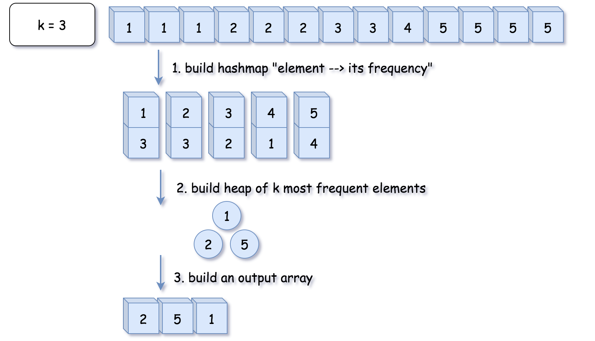

# Python knowledge

The != operator compares the value or equality of two objects, whereas the Python is not operator checks whether two variables point to the same object in memory.

Max number: float(“inf”)

## String:
To strip a string that contains special char and uppercases and space:

	s=”A man, a plan, a canal: Panama"
	filtered_chars = filter(lambda ch: ch.isalnum(), s)
        lowercase_filtered_chars = map(lambda ch: ch.lower(), filtered_chars)
        filtered_chars_list = list(lowercase_filtered_chars)

Check if all the characters in the text are alphanumeric:
	txt = "Company12"
	x = txt.isalnum()
	>>>True

Sort all characters in a string:
	a = 'ZENOVW'
	''.join(sorted(a))
	>>>'ENOVWZ'

## List:
Reverse a list:
	reversed_charlist = charlist[::-1]

Insert at the beginning of the list:
>>>var=7
>>>array = [1,2,3,4,5,6]
>>>array.insert(0,var)
>>>array
[7, 1, 2, 3, 4, 5, 6]
How it works:

array.insert(index, value)

Insert an item at a given position. The first argument is the index of the element before which to insert, so array.insert(0, x) inserts at the front of the list, and array.insert(len(array), x) is equivalent to array.append(x).Negative values are treated as being relative to the end of the array.

## Dict:
Check if a key exists in a dict:
https://stackoverflow.com/questions/1602934/check-if-a-given-key-already-exists-in-a-dictionary

	If use dict[‘key’] where key doesn’t exist, will result in KeyError
	If use dict.get(‘key’), if key doesn’t exist defaults to None, won’t raise error.

## Deque：
(Doubly Ended Queue) in Python is implemented using the module “collections“. Deque is preferred over a list in the cases where we need quicker append and pop operations from both the ends of the container, as deque provides an O(1) time complexity for append and pop operations as compared to list which provides O(n) time complexity. 
https://www.geeksforgeeks.org/deque-in-python/ 

Let’s see various Operations on deque : 
* append():- This function is used to insert the value in its argument to the right end of the deque.
* appendleft():- This function is used to insert the value in its argument to the left end of the deque.
* pop():- This function is used to delete an argument from the right end of the deque.
* popleft():- This function is used to delete an argument from the left end of the deque.


	Initializing: queue = collections.deque([root])
			    queue = collections.deque([1,2,3])
	
	add item to the duque:
	queue.append(node.left)
	
	remove item from the left: node = queue.popleft()
	remove item from the right: node = queue.pop()
	
Python swap two items:

	if node:
                node.left, node.right = node.right, node.left
     	why we don’t need to use a temp variable?

## Defaultdict
	Return a new dictionary-like object. defaultdict is a subclass of the built-in dict class. It overrides one method and adds one writable instance variable. The remaining functionality is the same as for the dict class.

Usage: initialize by passing the default_factory (type) of the value for each key. e.g. d = defaultdict(list)

When each key is encountered for the first time, it is not already in the mapping; so an entry is automatically created using the default_factory function which returns an empty list.
Using list as the default_factory, it is easy to group a sequence of key-value pairs into a dictionary of lists:

s = [('yellow', 1), ('blue', 2), ('yellow', 3), ('blue', 4), ('red', 1)]
>>> d = defaultdict(list)
>>> for k, v in s:
...     d[k].append(v)
...
>>> sorted(d.items())
[('blue', [2, 4]), ('red', [1]), ('yellow', [1, 3])]

The above technique is simpler and faster than an equivalent technique using dict.setdefault():
d = {}
>>> for k, v in s:
...     d.setdefault(k, []).append(v)
...
>>> sorted(d.items())
[('blue', [2, 4]), ('red', [1]), ('yellow', [1, 3])]

default_factory: int
Setting the default_factory to int makes the defaultdict useful for counting.
When a letter is first encountered, it is missing from the mapping, so the default_factory function calls int() to supply a default count of zero. The increment operation then builds up the count for each letter.

s = 'mississippi'
>>> d = defaultdict(int)
>>> for k in s:
...     d[k] += 1
...
>>> sorted(d.items())
[('i', 4), ('m', 1), ('p', 2), ('s', 4)]

Eg: leetcode 242

## Queue 
Queue is a linear data structure that stores items in First In First Out (FIFO) manner. With a queue the least recently added item is removed first.
There are various ways to implement a queue in Python. This article covers the implementation of queue using data structures and modules from Python library.Queue in Python can be implemented by the following ways: 
* list
* collections.deque
* queue.Queue

Implementation using list
List is a Python’s built-in data structure that can be used as a queue. Instead of enqueue() and dequeue(), append() and pop() function is used. However, lists are quite slow for this purpose because inserting or deleting an element at the beginning requires shifting all of the other elements by one, requiring O(n) time.

Python program to demonstrate queue implementation using list
  
### Initializing a queue
queue = []
  
### Adding elements to the queue
queue.append('a')
queue.append('b')
queue.append('c')
  
print("Initial queue")
print(queue) >>> ['a', 'b', 'c']
  
### Removing elements from the queue
print("\nElements dequeued from queue")
print(queue.pop(0)) >>> a
print(queue.pop(0)) >>> b
print(queue.pop(0)) >>> c
  
print("\nQueue after removing elements")
print(queue) >>> [ ]

Implementation using collections.deque
Queue in Python can be implemented using deque class from the collections module. Deque is preferred over list in the cases where we need quicker append and pop operations from both the ends of container, as deque provides an O(1) time complexity for append and pop operations as compared to list which provides O(n) time complexity. Instead of enqueue and deque, append() and popleft() functions are used. 

Python program to demonstrate queue implementation using **collections.deque**
  
  
from collections import deque
  
### Initializing a queue
q = deque()
  
### Adding elements to a queue
q.append('a')
q.append('b')
q.append('c')
  
print("Initial queue")
print(q) >>> deque(['a', 'b', 'c'])
  
### Removing elements from a queue
print("\nElements dequeued from the queue")
print(q.popleft()) >>> a
print(q.popleft()) >>> b
print(q.popleft()) >>> c
  
print("\nQueue after removing elements")
print(q) >>> deque([])

Implementation using queue.Queue
Queue is built-in module of Python which is used to implement a queue. queue.Queue(maxsize) initializes a variable to a maximum size of maxsize. A maxsize of zero ‘0’ means an infinite queue. This Queue follows FIFO rule. There are various functions available in this module:  
* maxsize – Number of items allowed in the queue.
* empty() – Return True if the queue is empty, False otherwise.
* full() – Return True if there are maxsize items in the queue. If the queue was initialized with maxsize=0 (the default), then full() never returns True.
* get() – Remove and return an item from the queue. If queue is empty, wait until an item is available.
* get_nowait() – Return an item if one is immediately available, else raise QueueEmpty.
* put(item) – Put an item into the queue. If the queue is full, wait until a free slot is available before adding the item.
* put_nowait(item) – Put an item into the queue without blocking. If no free slot is immediately available, raise QueueFull.
* qsize() – Return the number of items in the queue.

Python program to demonstrate implementation of queue using queue module

from queue import Queue

### Initializing a queue
q = Queue(maxsize = 3)

### qsize() give the maxsize of the Queue
print(q.qsize()) >>> 0

### Adding of element to queue
q.put('a')
q.put('b')
q.put('c')

### Return Boolean for Full
### Queue
print("\nFull: ", q.full()) >>> Full: True

### Removing element from queue
print("\nElements dequeued from the queue")
print(q.get()) >>> a
print(q.get()) >>> b
print(q.get()) >>> c

### Return Boolean for Empty
### Queue
print("\nEmpty: ", q.empty()) >>> Empty: True

q.put(1)
print("\nEmpty: ", q.empty()) >>> Empty: False
print("Full: ", q.full()) >>> Full: False


## map() function
map() function returns a map object(which is an iterator) of the results after applying the given function to each item of a given iterable (list, tuple etc.)

Syntax :

map(fun, iter)
Parameters :

fun : It is a function to which map passes each element of given iterable.
iter : It is a iterable which is to be mapped.

NOTE : You can pass one or more iterable to the map() function.

Returns :

Returns a list of the results after applying the given function  
to each item of a given iterable (list, tuple etc.) 

## sortedList
A list that keeps elements in sorted order.
import: `from sortedcontainers import SortedList`
Initialize:  `s = SortedList()`
https://grantjenks.com/docs/sortedcontainers/sortedlist.html 

```python
from sortedcontainers import SortedList

class Solution:
    def thirdMax(self, nums: List[int]) -> int:
        s = SortedList()
        for num in nums:
            if num not in s:
                s.add(num)
                if len(s) > 3:
                    s.pop(0)
        return s[0] if len(s) == 3 else s[-1]
```

作者：LeetCode-Solution
链接：https://leetcode.cn/problems/third-maximum-number/solution/di-san-da-de-shu-by-leetcode-solution-h3sp/

## min and max in
```python
a, b, c = float('-inf'), float('-inf'), float('-inf')
```

## stack

## looping
decrement: 

for n in range(6,0,-1):
    print n
# prints [6, 5, 4, 3, 2, 1]

loop though 2d array:
for i, j in product(range(m), range(n)):
    print (i, j)

it's equivalent to 
for i in range(m):
    for j in range(n):
        print(i, j)

## deque
Let’s see various Operations on deque : 

append():- This function is used to insert the value in its argument to the right end of the deque.
appendleft():- This function is used to insert the value in its argument to the left end of the deque.
pop():- This function is used to delete an argument from the right end of the deque.
popleft():- This function is used to delete an argument from the left end of the deque.

## 2d array
### initialize:
visited = [[None for _ in range(n)] for _ in range(m)]

## lambda
### sort an dictionary by its keys:
verticalOrderTraversal is a dict
sortedTraversal = dict(sorted(verticalOrderTraversal.items(), key=lambda x:x[0]))

## heapq
In Python, library heapq provides a method nlargest, which combines the last two steps under the hood and has the same \mathcal{O}(N \log k)O(Nlogk) time complexity.

e.g https://leetcode.com/problems/top-k-frequent-elements/solution/ 
```
from collections import Counter
class Solution:
    def topKFrequent(self, nums: List[int], k: int) -> List[int]: 
        # O(1) time 
        if k == len(nums):
            return nums
        
        # Step 1. build hash map : character as key and frequency as value
        # O(N) time
        count = Counter(nums)   
        # Step 2. build heap of top k frequent elements
        # Step 3. convert it into an output array
        return heapq.nlargest(k, count.keys(), key=count.get)
```


